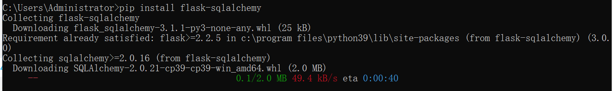
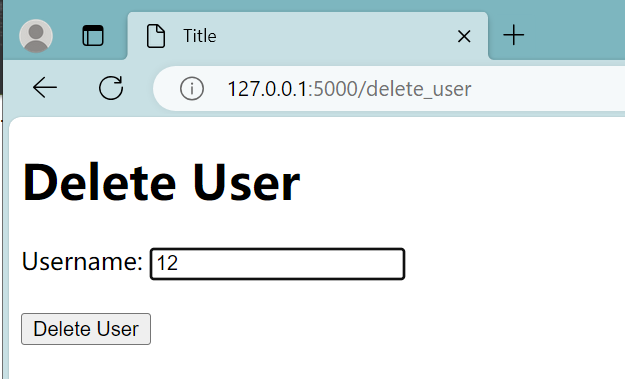

# Flask-SQLAlchemy

## Introduction

Flask-SQLAlchemy is a powerful extension to Flask that simplifies the integration of SQL databases with applications, and it leverages the SQLAlchemy library (*SQLAlchemy is a powerful Python SQL package that allows users to perform a variety of database operations, including creating, reading, updating and deleting (CRUD) data*) to provide an easy way to interact with databases. With Flask-SQLAlchemy, users can define models as Python classes corresponding to database tables, which makes working with databases very intuitive. It supports a wide range of relational databases, provides ORM (Object-Relational Mapping) functionality, and helps with tasks such as database migration, query optimisation and session management.

SQLAlchemy supports a wide range of database backends, including SQLite, MySQL, PostgreSQL, Oracle, and more, so user can easilychoose the suitable database for their project.


Open the system terminal, enter the following command and press the Enter key to install

> pip install flask-sqlalchemy




## Application--Simple login and registration page

Here we use a simple application to show how to perform various database operations (CRUD).

First we need to open pycharm and create a new project.


### **app.py**

1. Import modules and libraries

   we need to import necessary modules, including `Flask`, `render_template`, `redirect`,`request` , `session`and `SQLAlchemy` .

   - `Flask`: Import the Flask framework, it is used to create web applications.

   - `render_template`:used to render the HTML templates.

   - `redirect`: it is used to redirect the user's browser to a different page.

   - `session`: used to handle user sessions.

   - `SQLAlchemy`:used to handle database operations.

     ```python
     from flask import Flask, render_template, redirect, request, session

     from flask_sqlalchemy import SQLAlchemy
     ```

   ​

2. Create flask application and set up some configuration

   - Set the application's  SECRET_KEY, it is used for encrypting session data to insure security.
   - we use `SQLALCHEMY_DATABASE_URI` to specify the path to the SQLite database file.
   - create a SQLAlchemy  instance`db` and associate it with the flask application to handle database operations.

   ​

   ```python
   #Create a flask application
   app = Flask(__name__)
   app.config['SECRET_KEY'] = 'secretkey'  
   app.config['SQLALCHEMY_DATABASE_URI'] = 'sqlite:///users.db'  
   #Creating SQLAlchemy Objects
   db = SQLAlchemy(app)
   ```

   ​

3. Define user data mode

   We use `db.Model` to create a `User` data model for mapping to the User table in the database.

   ```python
   # User Data Model
   class User(db.Model):
       id = db.Column(db.Integer, primary_key=True)
       username = db.Column(db.String(50), unique=True, nullable=False)
       password = db.Column(db.String(100), nullable=False)
   # Define the __repr__ method
       def __repr__(self):
           return f'<User {self.username}>'
   # set up the application context
   with app.app_context():
       # Creat database tables
       db.create_all()
   ```


4. Define the route and perform database operations:

   - index route:

     It is the mian route of the application, user can accessed this page when navigate to the root URL("/"). It checks whether the user is logged in by verifying the existence of the 'username' in the session.If logged in, it retrieves all users from the database and displays a list of user IDs and usernames. It also provides two links: "Delete User" and "Update User Password."

     ```python
     # route：main
     @app.route('/')
     def index():

         if 'username' in session:
             # Retrieve all users from the database
             users = User.query.all()
             # Build a string with the "Successfully logged in" message
             message = 'Successfully logged in, username: ' + session['username'] + '<br>'+'<br>'

             # Add user information (id and username) to the message
             for user in users:
                 message += f'id: {user.id}, username: {user.username}<br>'
             # Add the "delete_user" link
             message += '<a href="/delete_user">Delete  user</a><br>'
             #Add the update password link
             message+= '<a href="/update_password">Update user password</a>'

             return message
         return 'not logged in'
     ```

     ​

   - login route

     Accessed  "/login," this route handles user login. It will check if a Post request(form submission) was made and tries to authenticate the user by querying the database with the provided username and password.If successful, the user is redirected to the main page, and their username is stored in the session.Otherwise, an error message is displayed.

     ```python
     # route:login
     @app.route('/login', methods=['GET', 'POST'])
     def login():
         if request.method == 'POST':
             username = request.form['username']
             password = request.form['password']
             user = User.query.filter_by(username=username, password=password).first()
             if user:
                 session['username'] = username
                 return redirect('/')
             else:
                 return 'login fail'
         return render_template('login.html')
     ```

   ​     

   - Logout Route

     accessed  "/logout," this route logs the user out.It simply removes the user's username from the session and redirects to the main page.

     ```python
     # route:logout
     @app.route('/logout')
     def logout():
         session.pop('username', None)
         return redirect('/')
     ```

     ​


   - Delete User Route

     This route allows users to delete other users.If a POST request is made , it will delete a user based on the provided username.It checks if the user exists, deletes the user's record from the database, and commits the change. Then a success or failure message is displayed.

     ```python
     #route:delete
     @app.route('/delete_user', methods=['GET', 'POST'])
     def delete_user():
         if request.method == 'POST':
             username = request.form.get('username')
             user = User.query.filter_by(username=username).first()
             if user:
                 db.session.delete(user)
                 db.session.commit()
                 return f'User {username} has been deleted.'
             else:
                 return 'User not found.'
         return render_template('delete.html')  # This renders the HTML form
     ```

     ​

   - Update Password Route

     This route allows users to change their password.If a POST request is made, it checks if the user is logged in. It verifies the old password, checks if the new password and confirmation match, and updates the password if everything is valid.

     ```python
     #route:update
     @app.route('/update_password', methods=['GET', 'POST'])
     def update_password():
         if request.method == 'POST':
             if 'username' in session:
                 username = session['username']
                 old_password = request.form.get('old_password')
                 new_password = request.form.get('new_password')
                 confirm_password = request.form.get('confirm_password')

                 # Check if the old password matches the current user's password
                 user = User.query.filter_by(username=username, password=old_password).first()
                 if user:
                     # Check if the new password and confirmation match
                     if new_password == confirm_password:
                         # Update the user's password
                         user.password = new_password
                         db.session.commit()
                         return 'Password updated successfully.'
                     else:
                         return 'New password and confirmation do not match.'
                 else:
                     return 'Old password is incorrect.'
             else:
                 return 'Not logged in.'
         return render_template('update.html')  # This renders the HTML form
     ```

     ​

   - Register Route:

     This route used to handle the user registration, it checks if the username already exist in the database when a POST request is made. If the username do not exist, a new user is created with the provided username and password.

     ```python
     #route: register
     @app.route('/register', methods=['GET', 'POST'])
     def register():
         if request.method == 'POST':
             username = request.form['username']
             password = request.form['password']

             # check whether the username is existence
             if User.query.filter_by(username=username).first():
                 return 'this username is already registered'
             # create new user
             new_user = User(username=username, password=password)
             db.session.add(new_user)
             db.session.commit()

             return 'Successful registration'

         return render_template('register.html')

     if __name__ == '__main__':
          app.run()
      
     ```


​     


### login.html

This form consists of username and password fields, and a login button. User need to enters a username and password and then submits the form to login.
A link is also provided to allow the user to jump to the registration page for new user registration.

```html
<body>
    <div class="container">
    <h1>Login</h1>
    <form method="POST">
        <label for="username">Username:</label>
        <input type="text" id="username" name="username" required><br><br>

        <label for="password">Password:</label>
        <input type="password" id="password" name="password" required><br><br>

        <input type="submit" value="login"><br><br>
        <a href="http://127.0.0.1:5000/register">register</a>
    </form>
    </div>
</body>
</html>
```


### **register.html**

This form consists of username and password fields, as well as a registration button.
The user need to enter the username and password and then submits the form to register

```html
<body>
    <div class="container">
    <h1>Register</h1>
    <form method="POST">
        <label for="username">Username:</label>
        <input type="text" id="username" name="username" required><br><br>

        <label for="password">Password:</label>
        <input type="password" id="password" name="password" required><br><br>

        <input type="submit" value="register">
    </form>
    </div>
</body>
```


### **delete.html**

The "Delete User" form allows a user to enter the username of the user they want to delete and submit the form to delete that user.

```html
<body>
      <h1>Delete User</h1>
    <form method="POST" action="/delete_user">
        <label for="username">Username:</label>
        <input type="text" id="username" name="username" required><br><br>
        <input type="submit" value="Delete User">
    </form>
</body>
```


### update.html

The "Update Password" form allows a user to change their password by entering their old password, new password, and confirming the new password.

```html
<body>
 <h1>Update Password</h1>
    <form method="POST" action="/update_password">
        <label for="old_password">Old Password:</label>
        <input type="password" id="old_password" name="old_password" required><br><br>
        <label for="new_password">New Password:</label>
        <input type="password" id="new_password" name="new_password" required><br><br>
        <label for="confirm_password">Confirm Password:</label>
        <input type="password" id="confirm_password" name="confirm_password" required><br><br>
        <input type="submit" value="Update Password">
    </form>
</body>
```


### **Result**

**main page--before login**


**login page**

enter the username and the password to login. If you want to create a new user, click on the register button.


**register page**

input the username and password and click register, a new user will be created.


**main page--successful login**

when successful login,you can see all the user in the page.


if you click on the Delete user ,it will change to the delete page. For example delete the user `12`



back to the main page, you will find the user `12`  has been deleted


 

If you click on the Update user password. For example, we change the password of the `123`user. we changed the password from`12` to `123`


Then back to the login page, and we find the password has been changed.


