# jinja
## Introduction
Jinja is a popular template engine based on Python, widely used in web development, especially in conjunction with web frameworks such as Flask and Django. It allows developers to use specific syntax structures in templates to dynamically generate HTML, XML, or other text format outputs. Jinja provides a flexible syntax and functionality that enables developers to easily integrate dynamic data into static templates, thereby creating dynamic web pages.

## Prepare the jinja

First, download the pip installation package for Windows from the Python website.
 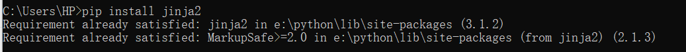

After the download is complete, you will get a compressed package and unzip the compressed package.
 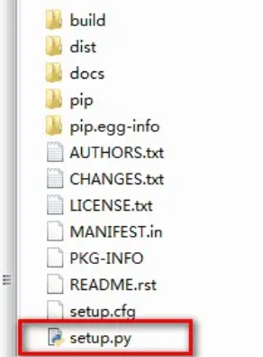

Open the system termina and use the cd command to access the uncompressed folder to the executable directory.

Type the following command on the console and press Enter, and the console will automatically install pip.
> python setup.py install

Enter the following command and press the Enter key to install.

> pip install Janja

 

## Basic API usage

The most basic way to do this is to create a template from a Template and render it. If your template is not loaded from a string, but from a file system or other data source, this is not the recommended way anyway:

   ```python
    from jinja2 import Template
    template = Template('Hello {{ name }}!')
    result = template.render(name='John Doe')
    print(result)
   ```
By creating an instance of the Template, you get a new template object that provides a method called render() that calls augmenting the template when there is a dictionary or keyword argument. The dictionary or keyword argument is passed to the template, the template "context".

## Basic structure
1. Set up routing and view functions (app.py)
First, we need to set up routing and view functions in the app.py file. In Flask, we can use the @app.route decorator to specify the URL path, and then define a corresponding view function to handle requests for this path. These view functions usually return a rendered template, as well as the data that needs to be passed to the template.

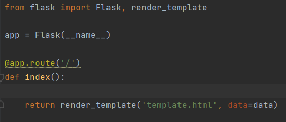

2. Design template file structure
In Flask, template files are used to render dynamic content, including HTML, CSS, JavaScript, etc. In the template file, we can insert variables through double curly braces {{ variable name }} to display dynamic content on the page. You can also use control structures, such as conditional statements and loop statements, to dynamically generate page content.

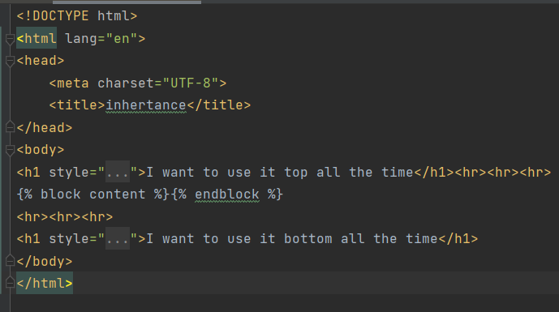

3. Static files
Flask allows us to create a folder called static in the root directory of the application to store static files such as images, CSS, and JavaScript files. These files do not need to be dynamically generated and therefore can be served directly from the server to the client.

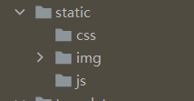


4. Import modules
 we need to import necessary modules, including `Flask`, `render_template`, `Template`

- `Flask`: It is a miniature Web framework written in python that is used for Web applications.

- `render_template`: It is used to render the template file with the data passed to it and generate the final HTML page.

- `Template`: It is used to process template files and generate rendered text.

```python

from jinja2 import Template

from flask import Flask, render_template

```


## Basic example

### ***variable***

#### **app .py**

a path should be given in "app.py": /test2_variable/<var_1>
`app.py`
```python
class Client:
    def __init__(self, id, name):
        self.ID = id
        self.Name = name

@app.route('/test2_variable/<var_1>')
def test2(var_1):  # put application's code here
    user = Client(1, "Dante")
    other_client = {
        "ID": 2,
        "name": "River"

    }
    return render_template("test2_variable.html", other_client_in_page = other_client, my_name="Dante", var_in_html = var_1, user_in_html = user)
```
- In this part, three variables are designed.
1. `var_1`: the variable is in the path and the data will be given by the clients. It will be transfer to the corresponding template.
2. `user`: this is a object from the class Client: ID is *1*, and name is *Dante*.
3. `other_client`: this is a directory with the ID of *2* and name of *river*
- `render_template` will help the programmer transfer the data in the variables to the template. And in template, those data will be saved in the corresponding variables in template. So, three new variables are designed.
1. `var_1`: var_in_html
2. `user`: user_in_html
3. `other_client`: other_client_page
4. new data can also be added directly in `render_tempate`, like "Dante" inside `my_name`.

#### **test2_variable.html**

In folder template. a file named `test2_variable.html` are designed.

If the programmer want to use the variables of the template, `{{the name of variable}}` is the rule to use them. two braces should be in both sides. In this file, `var_in_html` is used in line 10.

`test2_variable.html`
```html {.line-numbers}
<!DOCTYPE html>
<html lang="en">
<head>
    <meta charset="UTF-8">
    <title>variable</title>

</head>
<body>

    <h1>var in html is {{ var_in_html }}</h1>
    <h2>My name is Dante</h2>
    <h3>{{ user_in_html.ID }}</h3>
    <h3 style="color: white; background: black">user_in_html is {{ other_client_in_page.name }}</h3>
    <hr>

    {#bracket#}
</body>
</html>
```
- `var_in_html` the data inside the variable will be changed accroding to the path client input, the path **http://127.0.0.1:5000/test2_variable/aaa** is used to test, the data inside `var_in_html` is "aaa". it is the result from browser:

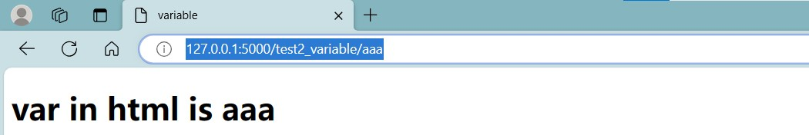

- `user_in_html` The data in the variable is an object with two parameters. We can use "variable.parameter_name" to show the parameters. It's similar to the common usage. Let it show the ID of the variable.

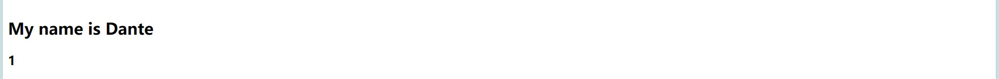

- `other_client_in_page` When we want to show the value in the directory, we can also use the same way: "variable.key_of_value". Let it show the name.

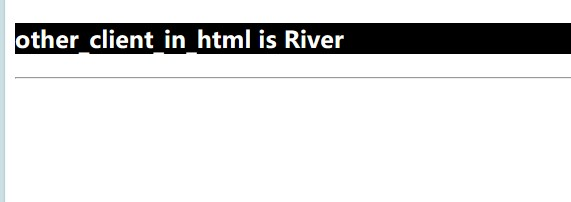


### ***filter***
Variables can be modified through "filters", which can be understood as built-in functions and string handling functions in jinja2.

#### **app .py**
```python
    @app.route('/')
    def index():
        # Sample data
        my_string = "hELLo WorLD"
        my_list = ['apple', 'banana', 'cherry']
        my_variable = None
        # Render templates and pass data and filters
        return render_template('template.html', my_string=my_string, my_list=my_list, my_variable=my_variable)
```
The render_template function in python code renders the template file template.html with the supplied data, and the variable name in template.html corresponds to the variable name passed in the first piece of code. Thus, when the Flask application runs, it populates the template in template.html based on the data passed in the render_template function, and finally generates an HTML page containing this data.

#### **template.html**
Need to use pipes after variables (|) Splitting, multiple filters can be called in chains, and the output of the previous filter is used as the input of the latter filter.

`template.html`
```html
    <!-- template.html -->
    <!DOCTYPE html>
    <html>
    <head>
        <title>Jinja2 Filter Example</title>
    </head>
    <body>
        <h2>Original String: {{ my_string }}</h2>
        <h2>Capitalized: {{ my_string|capitalize }}</h2>
        <h2>Lowercase: {{ my_string|lower }}</h2>
        <h2>Uppercase: {{ my_string|upper }}</h2>
        <h2>Default Value: {{ my_variable|default('No value provided') }}</h2>
        <h2>List Length: {{ my_list|length }}</h2>
        <h2>Joined List: {{ my_list|join(', ') }}</h2>
    </body>
    </html>
```

- In this part, five filters are designed.

1. `{{ my_string|capitalize }}`: This filter capitalizes the first letter of the my_string variable, converting the rest of the letters to lowercase.


2. `{{ my_string|lower }}`: This filter converts the my_string variable to lowercase.


3. `{{ my_string|upper }}`: This filter converts the my_string variable to uppercase.


4. `{{ my_list|length }}`: This filter calculates and displays the length of the list my_list.


5. `{{ my_list|join(', ') }}`: This filter joins the elements in the list my_list with commas and spaces to form a single string.


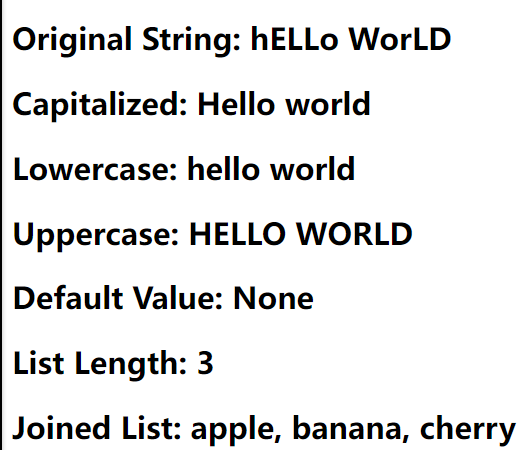


### ***static***

Static files are files that do not need to be generated dynamically in a web application, such as images, style sheets, and JavaScript files. In Flask, static files are usually stored in the static directory at the root of the application. Flask automatically exposes static files in that directory to the outside world so that they can be referenced in templates.
  

#### **app .py**
```python
    app = Flask(__name__)
    @app.route('/test6_static/')
    def test6():  # put application's code here
        return render_template("test6_static.html")
```
- `/test6_static/`:It is defined using the @app.route decorator, linking it to the function test6.
The test6 function calls the render_template function, which renders the template file named "test6_static.html" and returns the rendered content.
When a user accesses the URL **http://127.0.0.1:5000/test6_static//**, the Flask application will invoke the test6 function and return the rendered template content to the user's browser.

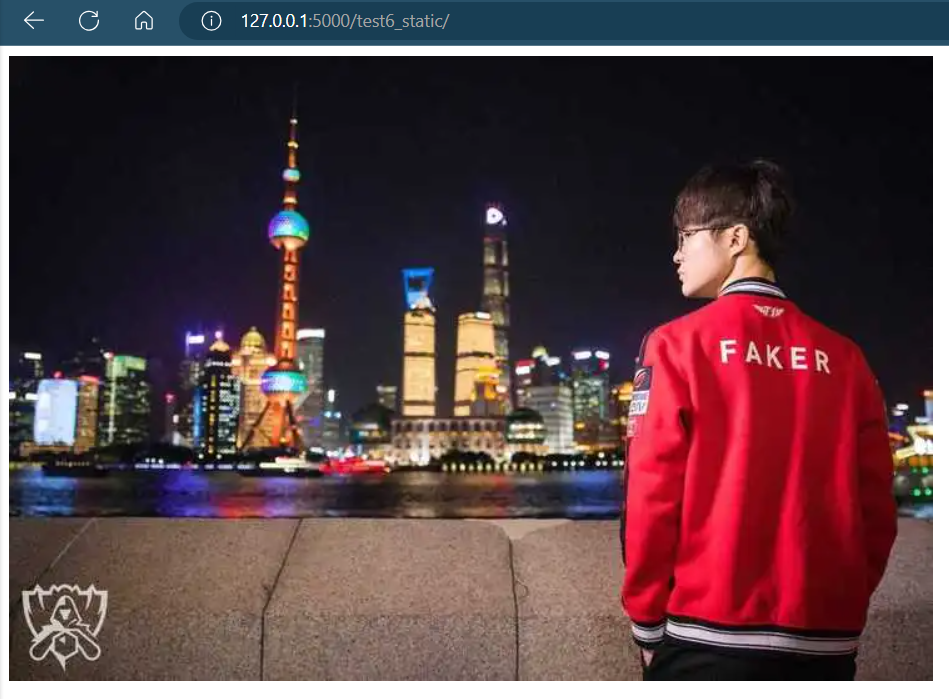

#### **test6_static.html**
`test6_static.html`
```html
    <!DOCTYPE html>
    <html lang="en">
    <head>
        {#<link rel="stylesheet" href="{{ url_for('static', filename='css/') }}">#}
        {#<script src="{{ url_for('static', filename='js/') }}"></script>#}
        <meta charset="UTF-8">
        <title>image</title>
    </head>
    <body>
        
    </body>
    </html>
```
Make sure you have files named style.css and script.js in the static folder. This way, when you access the root path of the Flask application, an HTML page containing a reference to a static file is returned.

### ***control***

In Flask, you can use the Jinja2 template engine to control the rendering logic in your templates.   This means that you can use conditional statements and loops in your templates to dynamically generate HTML content.   These controls determine whether to include specific HTML content at render time based on the data provided, you can pass data to the template as it renders, and use control structures to dynamically generate page content based on that data.   This allows you to generate different pages for different situations, providing a better user experience.

#### **app .py**
```python
    @app.route('/test4_control')
    def test4():  # put application's code here
        mark = 80
        #mark = 30
        T1 = [{
            "ID": "Faker",
            "position": "Mid"
        },
            {
            "ID": "Zeus",
            "position": "top"
            },
            {
            "ID": "Oner",
            "position": "jug"
            },
            {
            "ID": "Gumayusi",
            "position": "AD"
            },
            {
                "ID": "Keria",
                "position": "sup"
            }]
        return render_template("test4_control.html", mark_in_html= mark, T1_in_html = T1)
```

- `T1`: Defines a list of multiple dictionaries.

 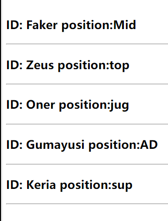

- `render_template`: The render_template function was called to render the template file named 'test4_control.html' and the values of the variables mark and T1 were passed.

Examples of conditional and loop statements:


```html
    <!DOCTYPE html>
    <html lang="en">
    <head>
        <meta charset="UTF-8">
        <title>control</title>
    </head>
    <body>

    # brace and percent symbol
    <h1>mark is {{ mark_in_html }}</h1>
    
        <h2>You have passed the exam</h2>
        
        <h2>Sorry, but don't panic</h2>
    
    <br>
    <br>
    <br>
    
        <h3>ID: {{ teammember.ID }} position:{{ teammember.position }}</h3><hr>
    
    </body>
    </html>
```
1. Conditional statements:
Jinja2's conditional statements are used to perform different actions in a template based on specific conditions. It allows us to execute different blocks of code depending on the truth or falsity of certain conditions.

- ``: It is a conditional statement. It checks if the variable mark_in_html is greater than or equal to 40. If the condition is true, it will show <h2>You have passed the exam</h2>, otherwise it will show <h2>Sorry, but don't panic</h2>.


2. Loop statements
- ``: It is a loop statement that iterates through each element in the list T1_in_html. In each iteration, the variable teammember represents an element in the list, and we can access its properties through the teammember.

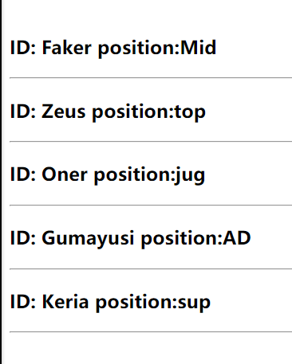


### ***inheritance***
The most powerful part of Jinja is template inheritance. Template inheritance allows you to build a basic template "skeleton" that contains elements common to your site and defines the blocks that child templates can override.
#### **app .py**
```python
@app.route('/test5_inheritance/')
def test5():  # put application's code here
    user2 = Client(3, "Faker")
    return render_template("test5_inheritance.html")
```
1. `test5_inheritance`: A view function named test5 is defined that handles GET requests for the /test5_inheritance/ path.
2. `user2`: A client object named user2 is created that has an attribute with ID 3 and the name "Faker".
3. `return`: It renders a template named test5_inheritance.html using render_template functions and returns it as an HTTP response.

### **Base template**`**
A base template is a template that contains a common web page structure and layout, which defines the overall frame of the web page and shared elements, such as navigation bars, footers, sidebars, and so on. The base template provides a unified structure that allows for a consistent look and layout when creating multiple web pages, as well as a convenient way to manage shared page elements. Let's go create a base template named template.html, it defines a simple HTML skeleton document.

```html
<!DOCTYPE html>
<html lang="en">
<head>
    <meta charset="UTF-8">
    <title>inhertance</title>
</head>
<body>
<h1 style="background: blue">I want to use it top all the time</h1><hr><hr><hr>

<hr><hr><hr>
<h1 style="background: blue">I want to use it bottom all the time</h1>
</body>
</html>
```

``: Define the areas that can be covered by subtemplates, such as .


### **Subtemplates**
In the child template, we extend the content in the parent template and override the title and content defined in the parent template in the block tag. The variables and filters defined in the parent template are still accessible in the child template, and new content can be defined.

```html


	<h2 style="background: khaki">this is the content</h2>

```

``: Subtemplate uses  to inherit the base template. Populates the  section of the base template.
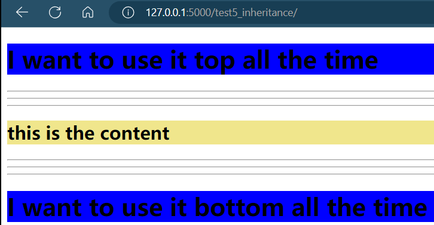
